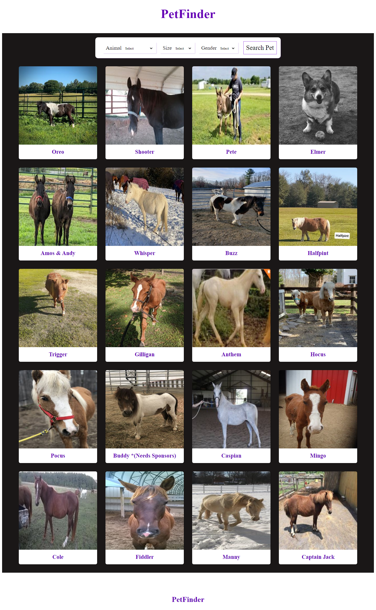
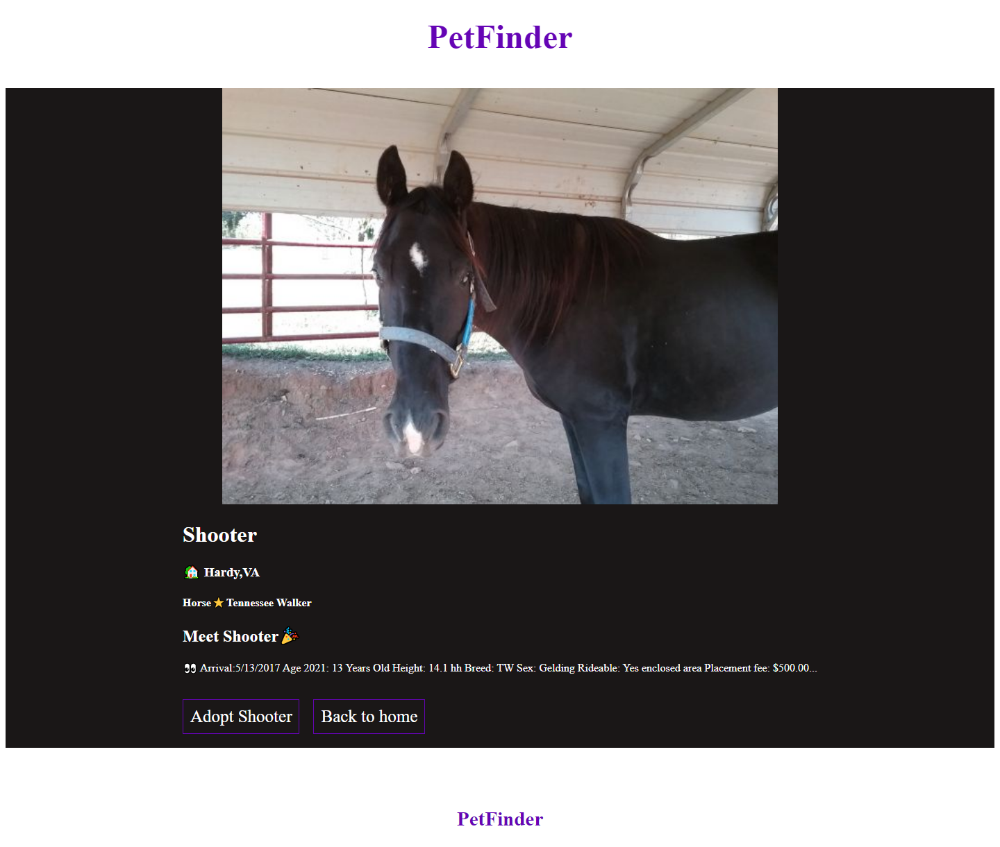

# Catalogue Of Pets

> This React Capstone project is a browsable catalogue of pets using React and Redux that enables users to filter and access details of a specific item.

# Search Page

# Details Page

This React Capstone project is a browsable catalogue of pets using React and Redux that enables users to filter and access details of a specific item this web app has three pages.

* Page with a list of pets that could be filtered by animal type
* Page for displaying lists of a particular animal type
* Page for displaying deatails of a particular pet

## Built With

* React
* PetFinder API
* Redux
* Hooks
* Router
* Css
* NodeJS

## Live Demo

[Live Demo Link](https://pets-catalogie.herokuapp.com/)

## Getting Started

**This is an example of how you may give instructions on setting up your project locally.**
**Modify this file to match your project, remove sections that don't apply. For example: delete the testing section if the currect project doesn't require testing.**

To get a local copy up and running follow these simple example steps.

### Prerequisites

### Setup

### Install

### Usage

### Run tests

### Deployment

## Authors

👤 **David Bassey**

* GitHub: [@davidosky007](https://github.com/davidosky007)
* Twitter: [@davidosky2](https://twitter.com/Davidosky2)
* LinkedIn: [David Bassey](https://www.linkedin.com/in/david-bassey-akan/)

## 🤝 Contributing

Contributions, issues, and feature requests are welcome!

Feel free to check the [issues page](issues/).

## Show your support

Give a ⭐️ if you like this project!

## Acknowledgments

* Hat tip to anyone whose code was used
* Inspiration
* etc

## 📝 License

This project is [MIT](lic.url) licensed.
